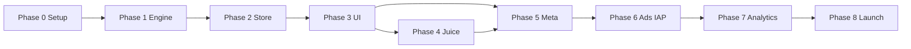

# BlockRush — Development Phases (Detailed)

**Parent:** [GAME-MASTER.md](../GAME-MASTER.md)

Each phase has **goals**, **tasks**, **exit criteria**, and **dependencies**. Do not start a phase until the previous phase’s exit criteria are met (unless noted).

---

## Phase 0 — Pre-production

**Goal:** Repo, tooling, and decisions ready so implementation never blocks on basics.

**Duration:** 1–2 days

### Tasks

- [x] Initialize Expo app (`blank-typescript` template) per [core-engine.md §1](../core-engine.md#1-project-setup)
- [x] Install dependencies (gesture-handler, reanimated, zustand, async-storage, expo-av, jest)
- [x] Configure `babel.config.js`, `jest.config.js`, test scripts
- [x] Create folder structure from [TECHNICAL-ARCHITECTURE.md](./TECHNICAL-ARCHITECTURE.md)
- [ ] Confirm app runs on Android emulator + one physical low-end device *(run `npm start` locally)*
- [x] Review [DECISIONS.md](./DECISIONS.md); log choices
- [x] Optional: EAS project + development build profile (`eas.json` added; run `eas login` when ready)

### Exit criteria

- App launches to a blank or placeholder screen
- `npm test` runs (even with zero tests)
- Folder structure matches architecture doc
- Git repo initialized with `.gitignore` (node_modules, `.expo`, env files)

### Deliverables

- Runnable Expo project
- This docs folder linked from GAME-MASTER

---

## Phase 1 — Core engine (logic only)

**Goal:** Pure TypeScript game rules — grid, pieces, placement, score, game over — fully unit tested.

**Duration:** ~Week 1 (aligns with [core-engine.md §13](../core-engine.md#13-implementation-order))

**Rule:** Nothing in `src/engine/` imports React or React Native.

### Tasks (follow core-engine day order)

| Step | Module | Key functions |
|---|---|---|
| 1 | `constants.ts`, `types.ts` | Grid size, colors, scoring constants |
| 2 | `grid.ts` | `createGrid`, `cloneGrid`, `applyPieceToGrid` |
| 3 | `grid.ts` | `getFilledRows`, `getFilledCols`, `clearFilledLines` |
| 4 | `pieces.ts` | `PIECE_SHAPES`, `generatePieceSet` |
| 5 | `placement.ts` | `isValidPlacement`, `getAllValidPlacements`, `pixelToGridOrigin`, `findSnapPosition`, `getGhostCells` |
| 6 | `score.ts` | `calculatePlacementScore`, `calculateClearBonus`, `calculateTurnScore` |
| 7 | `gameOver.ts` | `isGameOver`, `isPiecePlayable` |
| 8 | `index.ts` | Re-exports |

### Tests (required)

- [x] `__tests__/grid.test.ts`
- [x] `__tests__/placement.test.ts`
- [x] `__tests__/score.test.ts`
- [x] `__tests__/gameOver.test.ts`
- [x] `__tests__/pieces.test.ts` — unique colors in set, no 3× LINE4

### Exit criteria

- `npm test` — all green
- Manual sanity: import engine in a small script or test harness; place pieces, verify clears and game-over on paper cases
- No UI required except optional debug console

### Reference

Full code contracts: [core-engine.md](../core-engine.md)

---

## Phase 2 — Game state & integration loop

**Goal:** Zustand store wires engine into a coherent turn loop; persistence hooks stubbed or implemented.

**Duration:** ~Week 2 start

### Tasks

- [x] Implement `src/store/gameStore.ts` per [core-engine.md §10](../core-engine.md#10-game-state-zustand-store)
- [x] Wire `placePiece` flow: apply → clear → score → used pieces → new set → game over check
- [x] `startNewGame`, `loadBestScore`, `saveGame`, `loadSavedGame`
- [x] Add `isAnimating` flag + `setAnimating` (UI sets in Phase 4)
- [x] Integration test: `__tests__/gameStore.test.ts` + tap-grid debug in `app/game.tsx`
- [x] Verify game-over only when **no** piece among current 3 can be placed anywhere

### Exit criteria

- Store drives full game logic without UI gestures
- Best score persists across app restart
- Save/load game state works (JSON via AsyncStorage)
- No duplicate placement when `isAnimating` is true

### Optional debug UI

A temporary screen with buttons (“place piece 0 at 0,0”) is acceptable to validate the loop before Phase 3.

---

## Phase 3 — Gameplay UI

**Goal:** Playable Classic mode screen — grid, three pieces, drag-and-drop, ghost preview, score display.

**Duration:** ~Week 3 (first half)

**Visual spec:** [CONTENT-SPEC.md](./CONTENT-SPEC.md)

### Tasks

#### Layout & theme

- [x] Design tokens: colors, spacing, typography (`src/theme/`)
- [x] Screen: dark background `#0D0D14`, grid `#1A1A2E` lines
- [x] `GameScreen` composition: header (score / best), grid, piece tray

#### Components

- [x] `GameGrid` — 8×8 from store; neon blocks + ghost overlay
- [x] `PieceTray` — three slots; dim used pieces
- [x] `DraggablePiece` — Gesture.Pan + Reanimated `runOnJS`
- [x] Measure `gridOriginX`, `gridOriginY`, `cellSize` via `useGridLayout`
- [x] Ghost overlay: `getGhostCells` at 30% opacity
- [x] On drop: `findSnapPosition` → `placePiece` or snap back to tray

#### Hooks

- [x] `useGridLayout` — `measureInWindow` for pixel ↔ grid
- [x] `useGameInput` — block input when `isAnimating` / game over
- [x] `usePieceDrag` — drag state + ghost computation

### Exit criteria

- Full game playable by touch: place all three pieces, lines clear (logic), score updates
- Ghost preview tracks finger smoothly
- Game over detected (logic); simple text/button OK for now
- 60fps during drag on target test device

### Not in this phase

- Clear animations, particles, combo text (Phase 4)
- Ad banner space (Phase 6) — but reserve bottom layout inset

---

## Phase 4 — Juice (animations & audio)

**Goal:** BlockRush “feels” better than Block Blast — clears, combos, haptics, SFX.

**Duration:** ~Week 3 (second half)

**Spec:** [CONTENT-SPEC.md § animations & audio](./CONTENT-SPEC.md)

### Tasks

#### Clear animation sequence

1. [x] Flash cleared cells white (~80ms)
2. [x] Scale row/col 1.0 → 1.04 → collapse
3. [x] Particle burst (8–12 squares) via Reanimated
4. [x] Score pop flying up from line center
5. [x] Screen edge glow pulse
6. [x] Combo (2+ lines): “COMBO x2” + screen shake ±3px, 120ms
7. [x] Set `isAnimating` true for duration; block input

#### Audio (expo-av)

- [x] Place / clear / combo / game over tones (procedural WAV)
- [x] SFX toggle on game header (persisted)

#### Haptics

- [x] Light impact on place; medium/heavy on clear/combo; notification on new best / game over

### Exit criteria

- Clear sequence matches CONTENT-SPEC timing (tunable ±20ms)
- No input during animation; no double-score bugs
- Audio does not block UI thread; fails gracefully if files missing

---

## Phase 5 — Meta screens & persistence

**Goal:** Complete player-facing flow outside the core grid.

**Duration:** Week 3–4

### Tasks

- [x] **Splash / Home** — logo, Play, best score, settings gear
- [x] **Game over screen** — final score, best, Play Again, Home
- [x] New best: trophy animation + haptic
- [x] **Settings** — sound on/off, music on/off (optional), remove-ads status display
- [x] **Pause** (optional v1) — omitted; documented in [DECISIONS.md](./DECISIONS.md)
- [x] Auto-save on background / app pause via `saveGame`
- [x] Resume prompt if saved game exists
- [x] Expo Router routes: `app/index.tsx` (home), `app/game.tsx`, `app/settings.tsx`

### Exit criteria

- Cold start → home → game → game over → home loop works
- Best score and mid-game save survive kill and relaunch
- No dead ends in navigation

---

## Phase 6 — Monetization

**Goal:** AdMob + Remove Ads IAP without breaking gameplay.

**Duration:** Week 4

**Spec:** [MONETIZATION-ANALYTICS.md](./MONETIZATION-ANALYTICS.md)

### Tasks

- [x] `react-native-google-mobile-ads` via dev client / EAS (not Expo Go for production ads)
- [x] Banner: bottom of game screen (layout from Phase 3 inset)
- [x] Interstitial: on game over, max 1 per 3 minutes
- [x] Rewarded: “Watch to continue” — remove 3 random blocks + one more turn
- [x] IAP: Remove Ads — hide banner + interstitial; keep rewarded optional
- [x] Persist purchase flag in AsyncStorage
- [x] Test ad units in dev; production units before submit (see [MONETIZATION-SETUP.md](./MONETIZATION-SETUP.md))

### Exit criteria

- Ads respect frequency caps and purchase state
- Rewarded continue restores playable state without corrupting grid logic
- IAP restore path documented for store review

---

## Phase 7 — Analytics & polish

**Goal:** Measure funnel; fix rough edges; prepare for store.

**Duration:** Week 4–5

### Tasks

- [x] Firebase Analytics: `game_start`, `game_over`, `score`, `lines_cleared`, `ad_rewarded`, `iap_remove_ads`
- [x] Performance pass: Hermes, reduce re-renders, memoize grid cells if needed
- [x] Error boundaries / graceful AsyncStorage failures
- [x] App icon + splash (splash configured; final icon art in Phase 8)
- [x] Tablet / notch safe areas (`SafeAreaView` on screens)
- [x] Accessibility: minimum touch targets 44pt

### Exit criteria

- Events visible in Firebase DebugView
- No jank on 2GB RAM device in 10-minute session
- Icon and splash ready for store assets

---

## Phase 8 — QA & store launch

**Goal:** Ship BlockRush: Neon Block Puzzle on Google Play (Android first).

**Duration:** Week 5

**Checklist:** [QA-RELEASE.md](./QA-RELEASE.md)

### Tasks

- [x] Release tooling: EAS profiles, npm scripts, `.env.example`, [LAUNCH-RUNBOOK.md](./LAUNCH-RUNBOOK.md)
- [x] Store listing copy: [STORE-LISTING.md](./STORE-LISTING.md)
- [x] Privacy policy draft: [legal/PRIVACY-POLICY.md](./legal/PRIVACY-POLICY.md) (host before submit)
- [x] Data safety guide: [PLAY-CONSOLE-DATA-SAFETY.md](./PLAY-CONSOLE-DATA-SAFETY.md)
- [x] Corrupt save → graceful recovery (engine QA item)
- [ ] Internal testing track upload via EAS (`eas build --profile preview`)
- [ ] Closed beta (5–10 testers) — feedback on feel and ads
- [ ] Fix P0/P1 bugs from beta
- [ ] Store graphics: screenshots + feature graphic ([store-assets/README.md](../store-assets/README.md))
- [ ] Privacy policy URL live in Play Console
- [ ] Content rating questionnaire
- [ ] Production release
- [ ] iOS backlog for weeks 6–8

### Exit criteria

- Play Store listing live (or approved pending publish)
- [GAME-MASTER.md](../GAME-MASTER.md) v1 checklist complete
- Tag release in git

---

## Dependency graph

---

## Risk register (solo dev)

| Risk | Mitigation |
|---|---|
| Scope creep (modes, features) | GAME-MASTER v1 checklist; defer to v2 |
| AdMob + Expo config pain | EAS dev build early in Phase 6 |
| Animation bugs / double place | `isAnimating` + store guards |
| Performance on low-end Android | Test device in Phase 0; profile in Phase 7 |
| Piece difficulty spikes | Weights in `pieces.ts`; playtest tuning post-launch |

---

*Update phase status in [GAME-MASTER.md](../GAME-MASTER.md) when exit criteria are met.*
